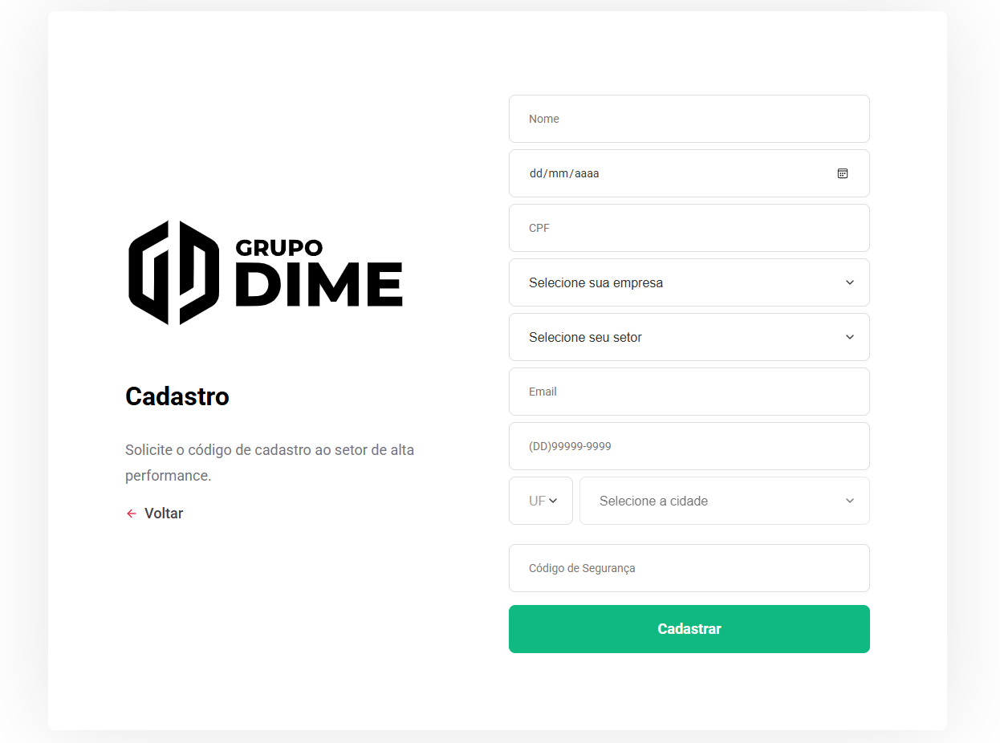
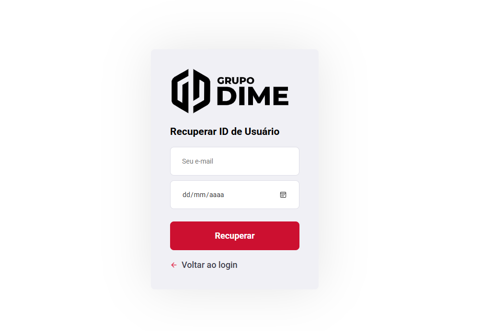
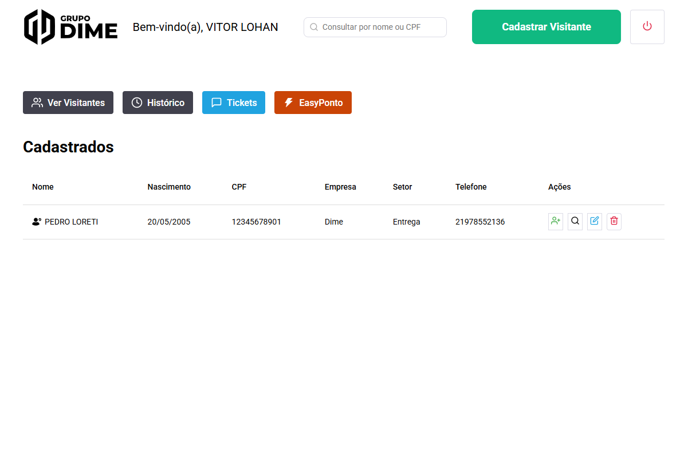
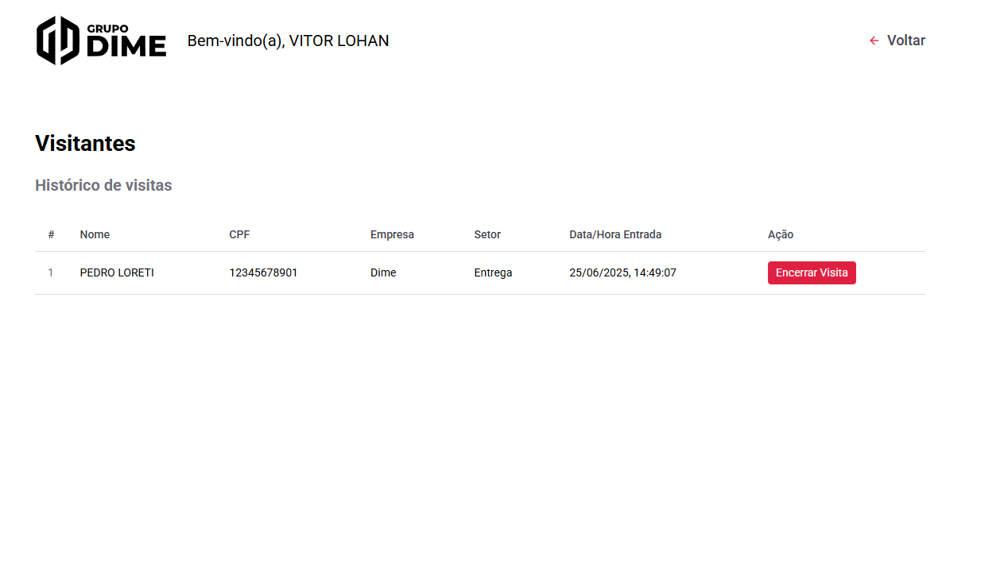
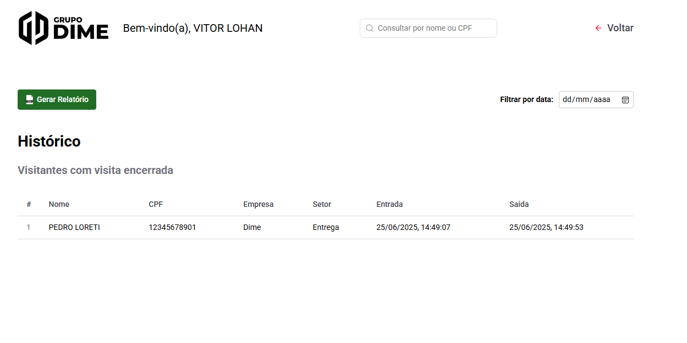
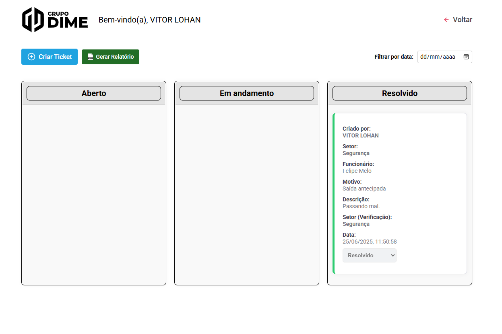
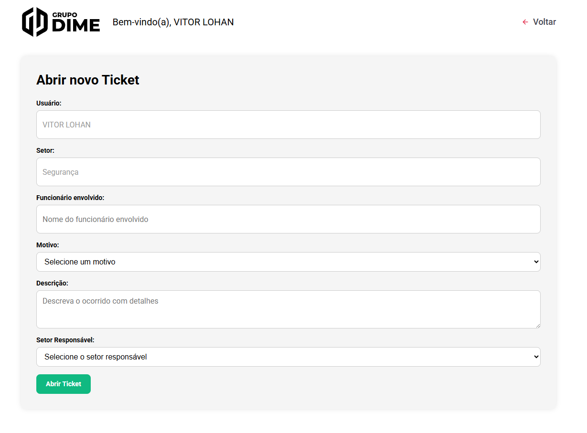

<!-- então bora codar! -->

<h1 align="center">
    
</h1>

<h2 align="center">Sistema de Visitante <strong>Liberaê</strong></h2>

<h3 align="center">
   React &nbsp;|&nbsp;
   React Native &nbsp;|&nbsp;
   Node.js &nbsp;|&nbsp;
   PostgreSQL
</h3>

  Utilizando de uma única linguagem moderna e popular:  <strong>JavaScript</strong>. 
  Produtividade e performance de forma enxuta.

---

## 🛡️ Sobre o sistema

**Liberaê** é um sistema completo de controle de visitantes e acesso corporativo, desenvolvido para otimizar a segurança e a gestão de entradas e saídas em ambientes empresariais.

### 🔑 Funcionalidades principais:

- **Cadastro de visitantes:** Registre visitantes com todos os dados necessários de forma rápida e prática.
- **Triagem de entrada e saída:** Controle e monitore a entrada e saída dos visitantes em tempo real.
- **Relatórios completos:** Gere relatórios detalhados de visitas por período, status e muito mais.
- **Sistema de tickets:** Permite que colaboradores solicitem à portaria a liberação de saída fora do horário padrão, com notificação imediata.
- **Bipagem de crachá:** Registro de entrada e saída de funcionários por leitura de código de crachá — ideal como alternativa quando a catraca estiver inoperante.

---

## 🖥️ Telas do sistema

### 🔐 Login e Cadastro

---

### 🆔 Recuperar ID e Perfil

---

### 👤 Visitante e Histórico

---

### 🎫 Ticket DashBoard e Criar Ticket

---

## 👨‍💻 Desenvolvedor

**Vitor Lohan 👽**

## 📄 Licença

[MIT](https://choosealicense.com/licenses/mit/)
